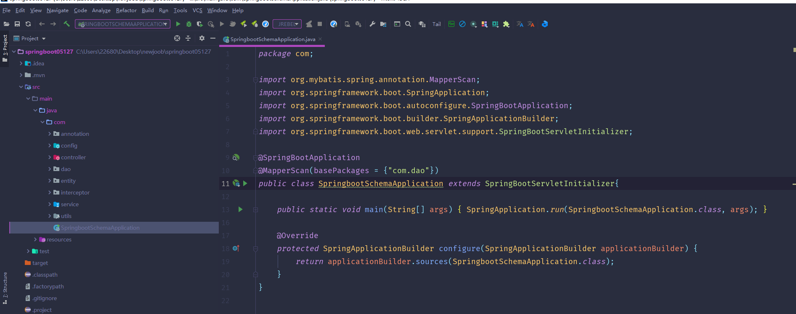
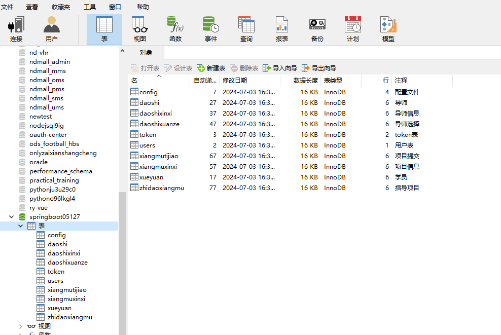
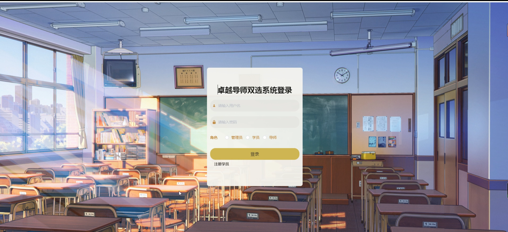
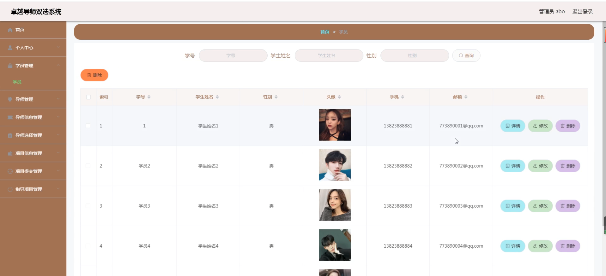
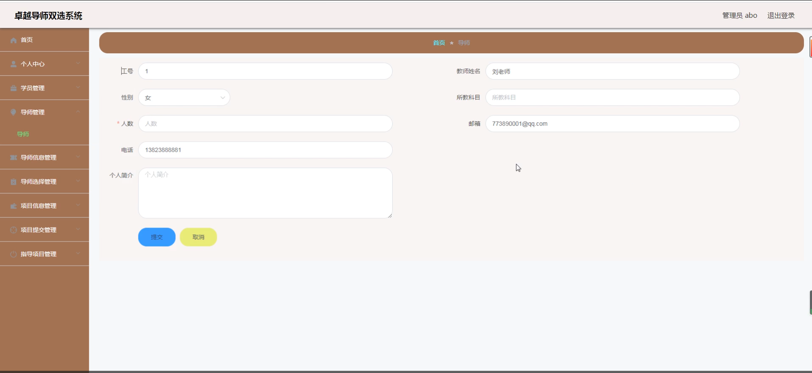
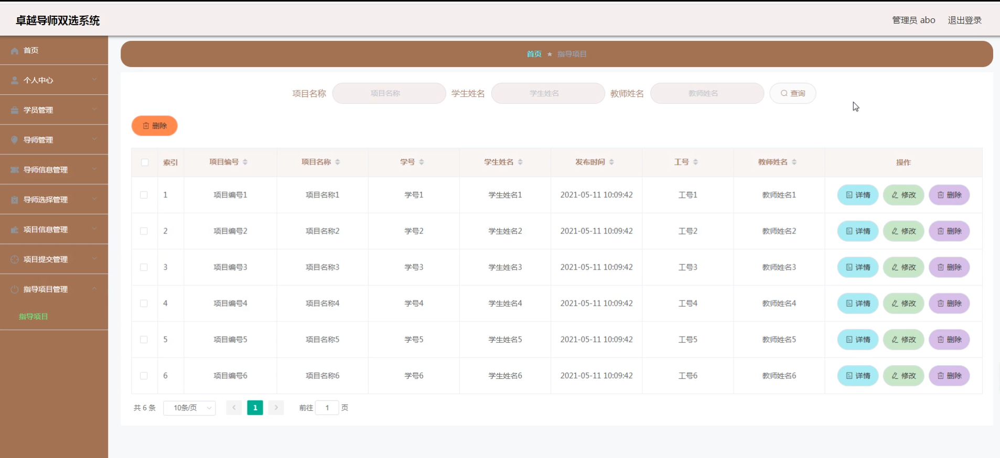
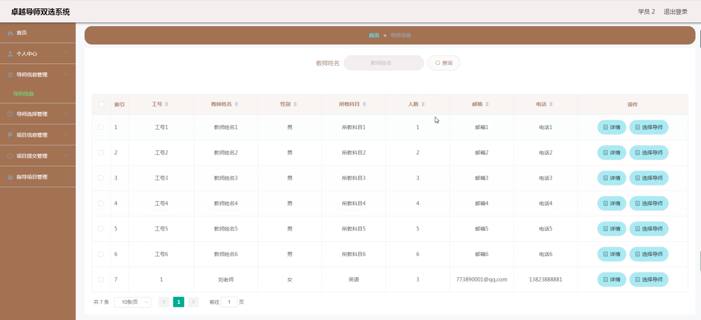
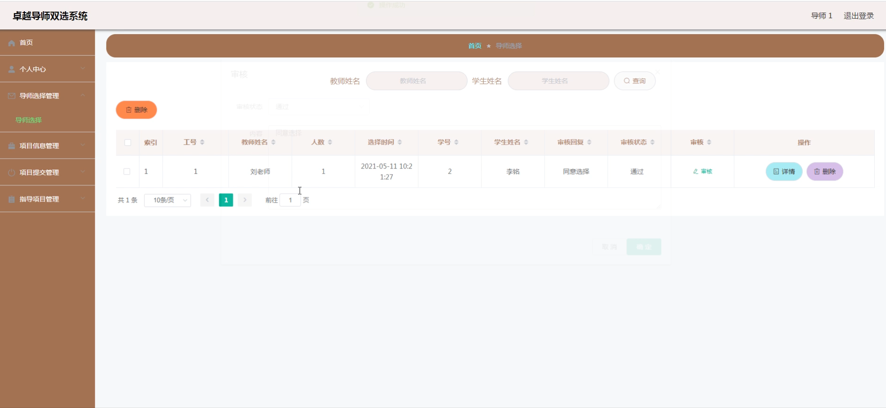
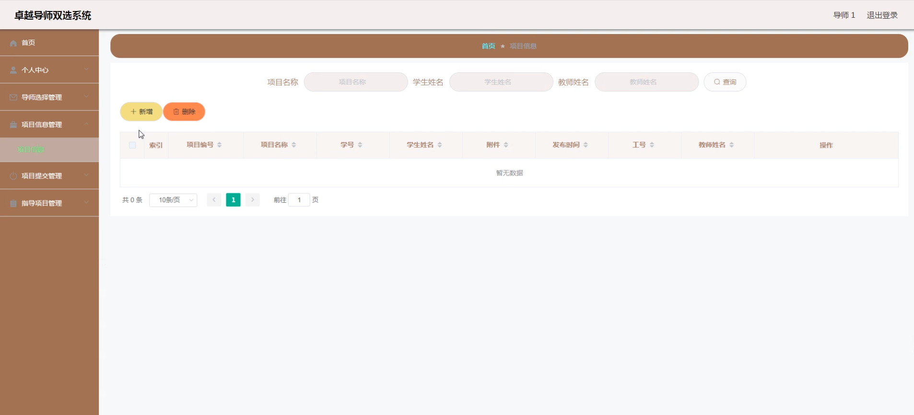
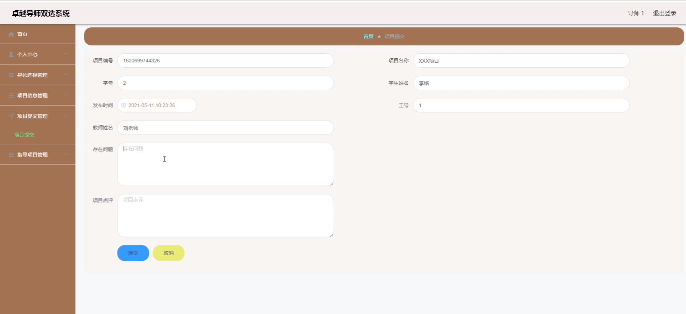

# 基于SpringBoot技术的卓越导师双选系统

#### 介绍

在当今教育和培训领域，为了实现更精准、高效的导师与学员匹配，提高教学和指导质量，我们开发了这款基于 Spring Boot 技术的卓越导师双选系统。该系统旨在为教育机构、企业培训部门等提供一个便捷、智能化的平台，促进导师和学员之间的双向选择，实现资源的优化配置和教学效果的最大化。

#### 技术栈

后端技术栈：Springboot+Mysql+Maven

前端技术栈：Vue+Html+Css+Javascript+ElementUI

开发工具：Idea+Vscode+Navicate

#### 系统功能介绍

（一）管理端  
个人中心：管理端用户可以在此查看和修改个人信息，接收系统通知以及进行个性化设置。  
学员管理：全面掌握学员的基本信息、学习背景、需求偏好等。可以对学员进行分组管理、状态标注（如已选导师、未选导师等），还能对学员的账号进行启用、禁用等操作。  
导师管理：负责导师的信息录入、资质审核、工作安排等。能够查看导师的详细履历、教学成果、擅长领域等，对导师的教学能力进行评估和分级。  
导师信息管理：对导师的个人信息进行详细的登记和维护，包括姓名、性别、年龄、学历、工作经历、研究方向等。可以对导师信息进行增删改查，确保信息的准确性和时效性。  
导师选择管理：监控导师与学员的选择过程，处理选择过程中的异常情况，如多位学员选择同一位导师时的调配等。同时，为导师和学员提供选择建议和指导，提高选择的合理性和满意度。  
项目信息管理：对各类指导项目进行分类、编号、描述和发布。包括项目的名称、目标、要求、时间安排、预期成果等。可以随时更新项目信息，确保导师和学员获取最新的项目详情。  
项目提交管理：审核学员和导师提交的项目成果、报告、文档等。对提交的内容进行质量评估，给出反馈意见，决定是否通过审核，以及是否需要进一步修改完善。  
指导项目管理：对正在进行的指导项目进行全程跟踪和监控。可以查看项目的进度、交流记录、问题反馈等，及时协调解决项目中出现的问题，保障项目顺利进行。  

（二）导师端  
个人中心：导师可以在此修改个人资料，查看工作通知、学员选择情况以及项目安排。  
导师选择管理：查看学员的选择意向，根据自身情况决定是否接受学员。也可以主动选择心仪的学员，并向管理端提出申请。  
项目信息管理：浏览系统发布的项目信息，选择感兴趣或擅长的项目进行指导。可以对项目提出疑问或建议，与管理端沟通项目细节。  
项目提交管理：提交自己指导的项目的相关成果和报告，查看管理端的审核意见和反馈，根据要求进行修改和完善。  
指导项目管理：与学员进行沟通交流，制定项目计划，指导学员完成项目任务。查看项目的进度和质量，及时给予学员指导和帮助。  

（三）学员端  
个人中心：学员可以在此完善个人信息，查看导师选择结果、项目分配情况以及系统通知。  
导师信息管理：查看导师的详细资料和介绍，了解导师的研究方向、教学风格、过往成果等，为选择导师提供参考。  
导师选择管理：根据自己的需求和兴趣选择心仪的导师，并提交选择申请。可以查看导师的反馈和选择结果。  
项目信息管理：浏览系统发布的各类项目信息，了解项目的具体要求和目标，选择适合自己的项目。  
项目提交管理：向管理端提交自己参与项目的成果、报告和总结，等待审核和反馈。  
指导项目管理：与导师保持沟通，按照导师的指导完成项目任务。记录项目的进展和问题，及时向导师请教和汇报。  

#### 系统作用

1. 提高匹配效率  
改变了传统的人工分配导师和学员的方式，通过智能化的算法和信息展示，让导师和学员能够更快速、更准确地找到彼此，大大提高了匹配的效率和满意度。  
2. 个性化发展  
学员可以根据自己的兴趣和发展方向选择适合的导师，导师也能挑选与自己研究领域和教学风格相契合的学员，有助于实现个性化的教学和指导，促进学员的特长发展和导师的专业发挥。  
3. 增强互动与合作  
系统为导师和学员提供了便捷的沟通渠道和项目协作平台，促进双方在教学和学习过程中的互动与合作，提高教学效果和学习质量。  
4. 优化资源配置  
管理端能够全面掌握导师和学员的情况以及项目的进展，从而进行更合理的资源调配和管理，确保教育资源得到充分利用。  
5. 提升教学管理水平  
为管理端提供了强大的数据分析和决策支持功能，能够对导师和学员的表现进行评估，对教学过程进行监控，及时发现问题并采取措施加以改进，提升教学管理的科学性和规范性。  

#### 系统功能截图

代码结构

数据库表

登录

学员管理

导师管理

指导项目管理

导师信息管理

导师端导师选择管理

项目信息管理

项目提交管理

#### 总结

本卓越导师双选系统基于 Spring Boot 技术，通过清晰的角色划分和丰富的功能模块，实现了导师与学员之间的高效双向选择和精准匹配。这不仅为教学和指导工作带来了便利，提高了教育质量和效果，也为教育领域的信息化、智能化发展提供了有力的支持。未来，我们将继续优化和完善该系统，以适应不断变化的教育需求和技术发展趋势。

#### 使用说明

创建数据库，执行数据库脚本 修改jdbc数据库连接参数 下载安装maven依赖jar 启动idea中的springboot项目

后台地址：http://localhost:8080/springboot05127/admin/dist/index.html

管理员  abo 密码 abo